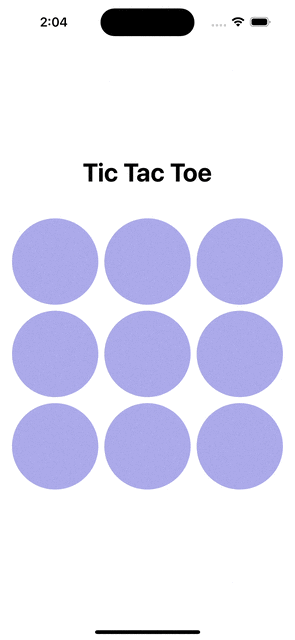
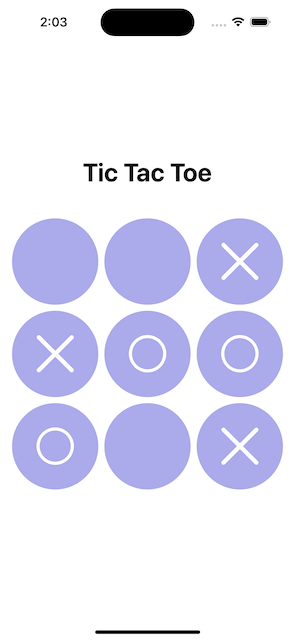

# Tic-Tac-Toe
A game of Tic Tac Toe built entierly using SwiftUI, with a custom AI opponent.
The project is built using MVVM architecture.

### Featuring
- Custom AI opponent.
- MVVM architecture.
- SF Symbols.

### AI Logic
1. If the AI can make a winning move, then win.
2. If the AI can't make a winning move, then block the human player.
3. If the AI can't block the human player, then take the middle square.
4. If the AI can't take the middle square, then take a random square.

The logic makes the game challenging, but the randomness makes it possible to win, and not end up with constant draws.

### Screenshots

